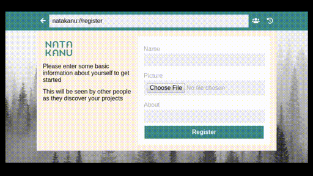

# [Natakanu](https://www.facebook.com/projetnatakanu/)

	

## À propos / About

Natakanu est un outil de création collaboratif.

Ce logiciel a été conçu pour permettre le transfert de fichiers (de tout type) selon une architecture pair-à-pair ([Hypercore](https://hypercore-protocol.org/) et [dat://](https://dat.foundation/) protocoles).

Il a pour objectif la création, la diffusion et la valorisation de ressources audiovisuelles autochtones (données, sons-images, vidéos, code, etc.)

Natakanu fonctionne en ligne comme hors ligne et s’inscrit dans une démarche de décolonisation du cyberespace.

——————

Natakanu is a collaborative tool. This file transfer software is built on the [Hypercore](https://hypercore-protocol.org/) and [dat://](https://dat.foundation/) peer to peer protocols.

It aims to increase accessibility to tools for sharing, collaboration and transmission of Indigenous cultures, knowledge and artistic expressions.

Natakanu works offline and online. This local first software embodies our approach of de-colonized cyberspace.

### [Click here to learn more](http://blog.mauve.moe/posts/natakanu)

## [Download](https://github.com/Wapikoni-Technique/Natakanu/releases)

### [Click here for video description](https://www.facebook.com/projetnatakanu/videos/634186250638330/)

## Credits

Ce logiciel est une réalisation de Wapikoni Mobile, Uhu Labos Nomades et du Bureau de l’engagement communautaire de l’université Concordia.
Projet financé dans le cadre de l’Entente sur le développement culturel de Montréal conclue entre la Ville de Montréal et gouvernement du Québec.

This project is made possible thanks to the collaboration of Wapikoni mobile and its technical team, Uhu Labos Nomades (Indigenous media arts training project working with Indigenous youth) and Concordia University’s Office of Community Engagement.
This project was funded under the Montreal cultural development agreement between the city of Montreal and the government of Quebec.

## Contributing

- Make sure you have the following installed:
  - [Git](https://git-scm.com/)
  - [Node.js](https://git-scm.com/)
  - [node-gyp](https://github.com/nodejs/node-gyp)
  - [Yarn](https://yarnpkg.com/)
  - [GitHub](https://github.com/)
- Clone the repo with `git clone git@github.com:Wapikoni-Technique/Natakanu.git`
- Load the directory with `cd Natakanu`
- Use `yarn` to install dependencies
- Use `yarn dev` to start up dev folder.
- This project uses [React](https://reactjs.org/) and [Electron](https://www.electronjs.org/) for it's user interface
- Please open a [GitHub issue](https://github.com/Wapikoni-Technique/Natakanu/issues/new/choose) if you want to propose a change to the app before working on a pull request
- `/app/` contains all the application code
- `/app/core` contains the main p2p code
- `/app/containers` contains React container components which load data and provide actions to child components
- `/app/components` contains React components that are made to be purely UI focused. Most of them don't have state. Use individual CSS files for components
- `/app/Routes.js` is where the top level of the navigation lives if you want to add a page
- `/app/localization` contains the translations for the app. If you see a translation or text that needs to change, find it in `en.json` or `fr.json`

## Code of Conduct

Please abide by the guidelines of the [Contributor Covenant 2.0](https://www.contributor-covenant.org/version/2/0/code_of_conduct/) when engaging with this community.
